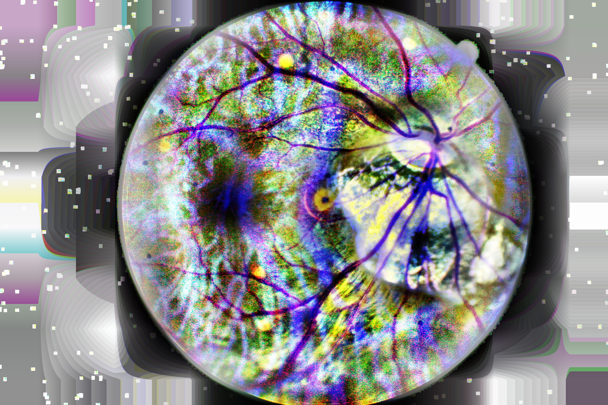

# Case 2. Diabetic Retinopathy Detection

* Authors: Martin Rožnovják, Lauri Solin
* Last edited: 2019-03-03
* Organization: [Metropolia University of Applied Sciences](https://www.metropolia.fi/)

## What is this?

This is an assignment for *Cognitive Systems for Health Technology Applications* course.

The goal is to use convolutional neural networks to create a classifier for diabetic retinopathy images.
We use the dataset from [Diabetic Retinopathy Detection](https://www.kaggle.com/c/diabetic-retinopathy-detection)
2015 [Kaggle](www.kaggle.com) competition.
It contains tens of thousands fundus photography images with and without signs of diabetic retinopathy
(the leading cause of blindness in the working-age population of the developed world,
it is estimated to affect over 93 million people
<a href="https://www.kaggle.com/c/diabetic-retinopathy-detection">[1]</a>).

Lauri and I were working on this assignment together, we shared ideas, insights and were giving
each other suggestions and helped with troubleshooting.

## Introduction

The dataset turned out to be a very challenging one. We struggled to find a model architecture which would train reasonably fast and would achieve good performance in terms of accuracy and receiver operating characteristic (ROC) curve. We were trying to follow advice and guidelines of various sources, mainly the following:

 - https://github.com/fchollet/deep-learning-with-python-notebooks/blob/master/5.2-using-convnets-with-small-datasets.ipynb
 - http://blog.kaggle.com/2015/09/09/diabetic-retinopathy-winners-interview-1st-place-ben-graham/
 - https://www.kaggle.com/c/diabetic-retinopathy-detection/discussion/15801
 - http://blog.kaggle.com/2015/08/14/diabetic-retinopathy-winners-interview-4th-place-julian-daniel/
 - https://www.ncbi.nlm.nih.gov/pmc/articles/PMC5961805/
 - course material
 
However, due to limited resources and large hyperparameter space we were unable to explore as many preprocessing and model pipelines as we intended. Most of our models performed close to random guessing and/or would always predict no symptoms.

For the sake of better organization and clarity, we will only link chosen preprocessing steps and models instead of embedding them in this notebook.

## Examples

### Preprocessing

In [this](https://github.com/rozni/uni-ml/blob/master/Cognitive_Systems_for_Health_Technology_Applications/Case_2/Image_Preprocessing.ipynb) notebook you can find how we preprocessed the data before feeding them into the network.

### Models

Following are the examples of our models:
 - [Cats & Dogs](https://www.kaggle.com/late347/returnable-convnet-case2)
 - [DeepGray](https://github.com/rozni/uni-ml/blob/master/Cognitive_Systems_for_Health_Technology_Applications/Case_2/Model-DeepGray.ipynb)
 - [Incepted](https://github.com/rozni/uni-ml/blob/master/Cognitive_Systems_for_Health_Technology_Applications/Case_2/Model-Incepted.ipynb)

Other than those, we have tried dozens of different model architectures in combination with various preprocessing methods.

## Conclusion

For a tough dataset one needs tough preparation.
There was a lot to learn about diabetic retinopathy, fundus photography,
we have also learnt new ways how process images and look at the data.
We improved our skills in many Python and ML libraries
and gained valuable insights into deep learning.
(And I understood I should finally invest into more RAM and an SSD... :-) )

Thanks to Google for [Colab](https://colab.research.google.com) and [Kaggle](https://www.kaggle.com/), their environments enabled us to try much more than we would otherwise be able to.

## Bonus

### When preprocessing goes wrong

